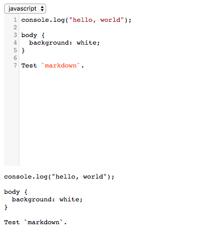

vue-code
===


A code editor based on Vue.js and CodeMirror.

Installation
---
``` sh
$ npm i vue-code
```

Usage
---
``` html
<vue-code v-model="code" :options="options"></vue-code>
```

``` js
import Vue from 'vue';
import VueCode from 'vue-code';

// require additional CodeMirror files
import 'codemirror/lib/codemirror.css';
import 'codemirror/mode/javascript/javascript';

new Vue({
  el: '#my-selector',
  components: {
    VueCode,
  },
  data: {
    code: 'console.log("hello, world");',
    options: {
      mode: 'javascript',
    },
  },
});
```

For more detailed usage, please see [demo](demo).

Document
---
* `<vue-code>`

  * props:

    * `options`

      An object to be passed directly to CodeMirror.

    * `value`

      The value of current editor.

  * This component is recommended to use with `v-model`.

Snapshots
---

